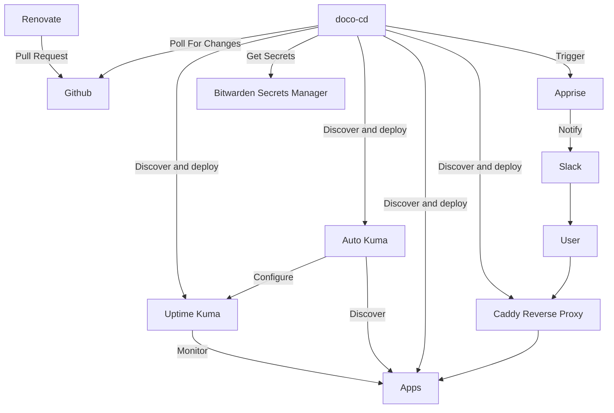

# docker-lab

Docker CI/CD testing repository using `doco-cd` and `renovate`, with automated discovery

## Diagram



## Deployment

- Clone repository to host
- Create `.env` file
- Run `docker compose up -d` in `/doco-cd`

### Env file

```
TBD - bitwarden and slack secrets
```